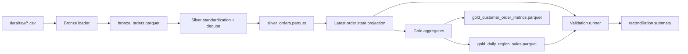

# lakehouse-reliability-lab

A production-style local lakehouse pipeline that lands raw order events into bronze, standardizes and deduplicates them into silver, publishes warehouse-friendly gold tables, and validates that the curated layer still reconciles with the raw business signal.

## Problem

Many data engineering demos stop at “the transform ran.” Real lakehouse work is harder: late-arriving events, duplicate deliveries, trustworthy medallion layers, and clear reconciliation between curated tables and the business truth. This repo focuses on that reliability story instead of just moving rows around.

The sample dataset is intentionally compact so the full workflow stays fast on a laptop, but it is not a throwaway fixture. The batches are shaped to exercise duplicate event removal, late-arriving state changes, multi-region revenue rollups, and customer-level reconciliation without hiding the logic behind a large opaque dataset.

## Production Grounding

This repo is meant to answer the reliability questions that show up in a real warehouse pipeline:

- what happens when a source system sends the same event twice
- what happens when a late record arrives after a newer state already exists
- what happens when schema drift or partial corruption slips into an upstream batch
- how you prove bronze, silver, and gold still reconcile to the business signal

The V1 story is intentionally practical: it lets you show a small medallion pipeline that catches those failures before they become a production incident.

## Architecture

The V1 implementation is deliberately local-first and transparent:

- raw CSV batches simulate incremental event deliveries
- bronze preserves raw ingestion history
- silver deduplicates by `event_id`, standardizes types, and produces the latest known state per order
- gold publishes consumption-ready revenue and customer metrics tables
- validation checks row integrity, duplicate removal, and reconciliation across both gold outputs



## Tradeoffs

This V1 makes three deliberate tradeoffs:

1. DuckDB is used instead of Spark so the full medallion flow stays runnable on a laptop without cluster setup.
2. The source system is one order-event domain, not a sprawling enterprise schema. The goal is to prove layer reliability and reconciliation discipline first.
3. Transform logic lives in Python plus SQL rather than dbt to keep the repo self-contained and easy to run in interviews.

## Repo Layout

```text
lakehouse-reliability-lab/
├── app/
│   ├── cli.py
│   ├── config.py
│   ├── pipeline.py
│   ├── validation.py
│   └── web.py
├── data/
│   └── raw/
├── tests/
├── render.yaml
└── warehouse/
```

## Run Steps

### Install Dependencies

```bash
git clone https://github.com/srn91/lakehouse-reliability-lab.git
cd lakehouse-reliability-lab
python3 -m pip install -r requirements.txt
```

### Build the Medallion Layers

```bash
make build
```

That command creates:

- `warehouse/bronze/bronze_orders.parquet`
- `warehouse/silver/silver_orders.parquet`
- `warehouse/silver/silver_latest_order_state.parquet`
- `warehouse/gold/gold_daily_region_sales.parquet`
- `warehouse/gold/gold_customer_order_metrics.parquet`

### Run Validation

```bash
make validate
```

`validate` is a read-only check against already-built parquet artifacts. Run `make build` first if you have not materialized the warehouse outputs yet.

### Run the Full Quality Gate

```bash
make verify
```

`make verify` is the most portable one-command gate in the repo. It keeps the build, validation, lint, and tests aligned with the shipped project state.

## Serve

The repo also exposes a small read-only FastAPI surface for local checks and Render deployment.

```bash
make serve
```

The service exposes:

- `GET /health` for readiness
- `GET /summary` for the current build and validation snapshot
- `GET /` as a small entrypoint that points to the API docs
- `GET /docs` and `GET /openapi.json` from FastAPI

The web app materializes the warehouse into the container on startup so the summary is useful in a hosted environment. The HTTP surface itself stays read-only.

## Render Deployment

This repo includes a minimal [`render.yaml`](./render.yaml) for a Render web service.

- Build command: `python3 -m pip install -r requirements.txt`
- Start command: `make serve`
- Health check path: `/health`

After deploy, open `/docs` and `/summary` to verify the service and inspect the pipeline snapshot.

## Hosted Deployment

- Live URL: `https://lakehouse-reliability-lab.onrender.com`
- Click first: [`/summary`](https://lakehouse-reliability-lab.onrender.com/summary)
- Browser smoke: Render-hosted `/summary` loaded in a real browser and returned the expected artifact + reconciliation snapshot.
- Render service config: Python web service on `main`, auto-deploy on commit, region `oregon`, plan `free`, build `python3 -m pip install -r requirements.txt`, start `make serve`, health check `/health`.
- Render deploy command: `render deploys create srv-d7n6593bc2fs738kjhjg --confirm`

## Validation

The repo currently verifies three reliability properties:

- duplicate raw deliveries collapse cleanly in silver
- each order has one latest-state record after reconciliation
- daily-region gold revenue matches the delivered revenue from silver latest-state records
- customer-level gold metrics cover every latest-state customer and reconcile delivered counts and revenue

Current expected validation snapshot:

- bronze rows: `11`
- silver rows after dedupe: `10`
- latest order states: `6`
- customer metric rows: `5`
- delivered revenue reconciliation across both gold outputs: `604.75`

Local quality gates:

- `make lint`
- `make test`
- `make validate`
- `make verify`

## Current Capabilities

The V1 repo demonstrates:

- medallion-style bronze, silver, and gold data layout
- late-arriving event handling through event-time vs ingestion-time ordering
- duplicate event removal in the silver layer
- warehouse-friendly gold aggregates for daily regional sales and customer metrics
- deterministic validation of business reconciliation between curated outputs and source truth
- fixed-point money handling so financial rollups stay exact end to end

## Next Steps

Realistic next follow-ups for the next milestone:

1. add schema evolution tests and explicit compatibility checks
2. partition outputs by event date for larger backfill scenarios
3. migrate transform steps into dbt or Spark for a larger-scale execution story
4. add freshness and SLA monitoring for each layer
5. extend the sample domain to returns, refunds, and slowly changing customer attributes
