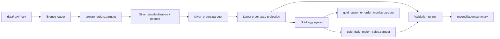

# lakehouse-reliability-lab

A production-style lakehouse pipeline that lands raw order events into bronze, standardizes and deduplicates them into silver, publishes warehouse-friendly gold tables, validates that the curated layer still reconciles with the raw business signal, and includes a shipped Spark/dbt scale-out lane for warehouse execution.

## Problem

Many data engineering demos stop at “the transform ran.” Real lakehouse work is harder: late-arriving events, duplicate deliveries, trustworthy medallion layers, and clear reconciliation between curated tables and the business truth. This repo focuses on that reliability story instead of just moving rows around.

The sample dataset is intentionally compact so the full workflow stays fast on a laptop, but it is not a throwaway fixture. The batches are shaped to exercise duplicate event removal, late-arriving state changes, multi-region revenue rollups, and customer-level reconciliation without hiding the logic behind a large opaque dataset.

## Production Grounding

This repo is meant to answer the reliability questions that show up in a real warehouse pipeline:

- what happens when a source system sends the same event twice
- what happens when a late record arrives after a newer state already exists
- what happens when schema drift or partial corruption slips into an upstream batch
- how bronze, silver, and gold still reconcile to the business signal

## Architecture

The implementation is deliberately local-first and transparent:

- raw CSV batches simulate incremental event deliveries
- bronze preserves raw ingestion history
- a schema contract check blocks missing or incompatible upstream columns before the bronze load runs
- silver deduplicates by `event_id`, standardizes types, and produces the latest known state per order
- gold publishes consumption-ready revenue and customer metrics tables
- validation checks row integrity, duplicate removal, reconciliation across both gold outputs, and freshness/SLA propagation for every layer
- a Spark job mirrors the same bronze/silver/gold contract for local cluster-style execution
- a dbt project mirrors the same medallion layers with model tests and a shared money-casting macro
- a Databricks-style deployment manifest wires the Spark and dbt assets into one orchestrated job definition



## Tradeoffs

This implementation makes three deliberate tradeoffs:

1. DuckDB is used instead of Spark so the full medallion flow stays runnable on a laptop without cluster setup.
2. The source system is one order-event domain, not a sprawling enterprise schema. The goal is to keep layer reliability and reconciliation discipline explicit.
3. The default verification path stays on DuckDB so laptop runs stay fast, while the Spark/dbt lane is scaffolded and validated as code rather than executed on every local test run.

## Repo Layout

```text
lakehouse-reliability-lab/
├── app/
│   ├── cli.py
│   ├── config.py
│   ├── pipeline.py
│   ├── scaleout.py
│   ├── validation.py
│   └── web.py
├── dbt/
├── deployment/
├── data/
│   └── raw/
├── spark_job/
├── tests/
├── render.yaml
└── warehouse/
```

## Run Steps

### Install Dependencies

```bash
git clone https://github.com/srn91/lakehouse-reliability-lab.git
cd lakehouse-reliability-lab
python3 -m pip install -r requirements.txt
```

### Build the Medallion Layers

```bash
make build
```

That command creates:

- `warehouse/bronze/bronze_orders.parquet`
- `warehouse/silver/silver_orders.parquet`
- `warehouse/silver/silver_latest_order_state.parquet`
- `warehouse/gold/gold_daily_region_sales.parquet`
- `warehouse/gold/gold_customer_order_metrics.parquet`

### Run Validation

```bash
make validate
```

`validate` is a read-only check against already-built parquet artifacts. Run `make build` first if you have not materialized the warehouse outputs yet.

### Run the Full Quality Gate

```bash
make verify
```

`make verify` is the most portable one-command gate in the repo. It keeps the build, validation, lint, and tests aligned with the shipped project state.

### Validate the Spark/dbt Scale-Out Assets

```bash
make scaleout
```

That command validates that the repo contains:

- a local Spark entrypoint at `spark_job/lakehouse_job.py`
- a Spark extra dependency file at `spark_job/requirements-spark.txt`
- a dbt project with bronze/silver/gold models and model tests
- a deployment manifest that references the Spark job and dbt project

### Run the Local Spark Path

The Spark lane is shipped as code, but it uses an optional dependency set so the default laptop verification path stays lightweight.

```bash
python3 -m pip install -r spark_job/requirements-spark.txt
python3 spark_job/lakehouse_job.py --input-glob "data/raw/*.csv" --output-root warehouse_spark
```

That job writes:

- `warehouse_spark/bronze/bronze_orders.parquet`
- `warehouse_spark/silver/silver_orders.parquet`
- `warehouse_spark/silver/silver_latest_order_state.parquet`
- `warehouse_spark/gold/gold_daily_region_sales.parquet`
- `warehouse_spark/gold/gold_customer_order_metrics.parquet`

## Serve

The repo also exposes a small read-only FastAPI surface for local checks and Render deployment.

```bash
make serve
```

The service exposes:

- `GET /health` for readiness
- `GET /summary` for the current build and validation snapshot
- `GET /` as a small entrypoint that points to the API docs
- `GET /docs` and `GET /openapi.json` from FastAPI

The web app materializes the warehouse into the container on startup so the summary is useful in a hosted environment. The HTTP surface itself stays read-only.

## Render Deployment

This repo includes a minimal [`render.yaml`](./render.yaml) for a Render web service.

- Build command: `python3 -m pip install -r requirements.txt`
- Start command: `make serve`
- Health check path: `/health`

After deploy, open `/docs` and `/summary` to verify the service and inspect the pipeline snapshot.

## Warehouse Scale-Up Assets

The repo now ships three concrete scale-out assets:

- `spark_job/lakehouse_job.py`: a local PySpark job that reproduces the bronze/silver/gold outputs outside the DuckDB path
- `dbt/`: a dbt project that mirrors the same medallion contract with model SQL, schema tests, and a reusable macro for decimal money handling
- `deployment/databricks_job.yml`: a Databricks-style job definition that chains the Spark build task and the dbt build task against the same repo assets

The hosted `/summary` endpoint includes a `scaleout` block so the shipped Spark/dbt/deployment evidence is visible through the API as well as in the filesystem.

## Hosted Deployment

- Live URL: `https://lakehouse-reliability-lab.onrender.com`
- Click first: [`/summary`](https://lakehouse-reliability-lab.onrender.com/summary)
- Browser smoke: Render-hosted `/summary` loaded in a real browser and returned the expected artifact + reconciliation snapshot.
- Render service config: Python web service on `main`, auto-deploy on commit, region `oregon`, plan `free`, build `python3 -m pip install -r requirements.txt`, start `make serve`, health check `/health`.
- Render deploy command: `render deploys create srv-d7n6593bc2fs738kjhjg --confirm`

## Validation

The repo currently verifies these reliability properties:

- every raw batch satisfies the expected schema contract, while additive columns are tracked explicitly
- duplicate raw deliveries collapse cleanly in silver
- each order has one latest-state record after reconciliation
- daily-region gold revenue matches the delivered revenue from silver latest-state records
- customer-level gold metrics cover every latest-state customer and reconcile delivered counts and revenue
- bronze, silver, and gold artifacts stay within the shipped freshness/SLA budget relative to the latest upstream watermark
- the Spark/dbt scale-out lane remains wired to the same bronze/silver/gold contract through checked-in code and deployment config

Current expected validation snapshot:

- schema files checked: `2`
- additive raw columns allowed: `none`
- bronze rows: `11`
- silver rows after dedupe: `10`
- latest order states: `6`
- customer metric rows: `5`
- delivered revenue reconciliation across both gold outputs: `604.75`
- freshness/SLA checks:
  - `bronze_orders`: `0` minute lag against source watermark, SLA `<= 5` minutes
  - `silver_orders`: `0` minute lag against source watermark, SLA `<= 10` minutes
  - `silver_latest_order_state`: `0` minute lag against source watermark, SLA `<= 10` minutes
  - `gold_customer_order_metrics`: `0` minute lag against latest event watermark, SLA `<= 15` minutes
  - `gold_daily_region_sales`: `0` day lag against latest event date, SLA `<= 0` days

Local quality gates:

- `make lint`
- `make test`
- `make validate`
- `make scaleout`
- `make verify`

## Current Capabilities

The repo demonstrates:

- medallion-style bronze, silver, and gold data layout
- raw schema compatibility enforcement before warehouse materialization
- late-arriving event handling through event-time vs ingestion-time ordering
- duplicate event removal in the silver layer
- warehouse-friendly gold aggregates for daily regional sales and customer metrics
- deterministic validation of business reconciliation between curated outputs and source truth
- per-layer freshness/SLA monitoring surfaced through CLI validation output and the hosted `/summary` API
- fixed-point money handling so financial rollups stay exact end to end
- a local Spark execution path for the same medallion layers
- a dbt project scaffold with concrete bronze/silver/gold models and tests
- deployment config that ties the Spark and dbt paths to the shipped repo code
